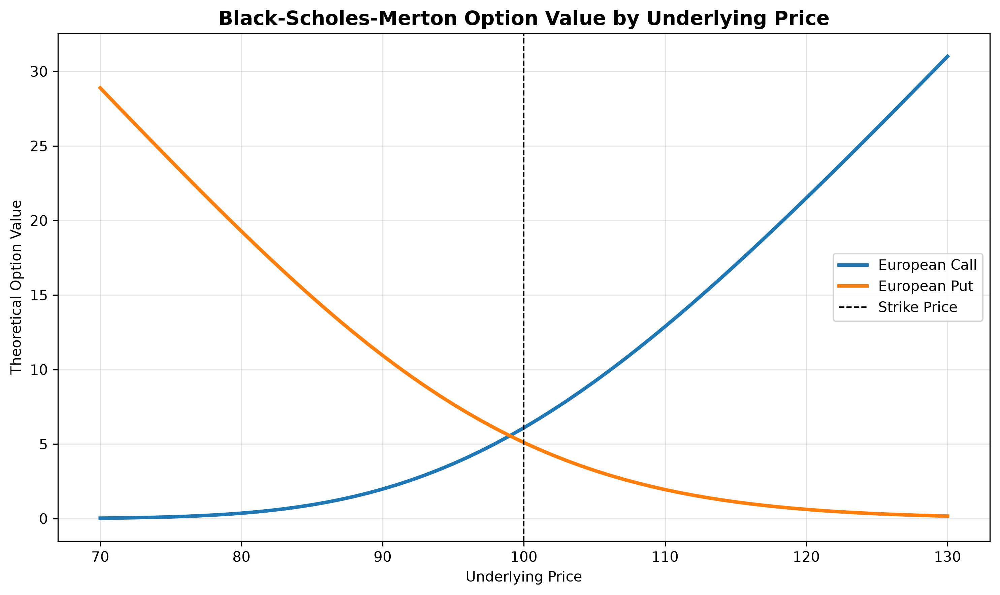
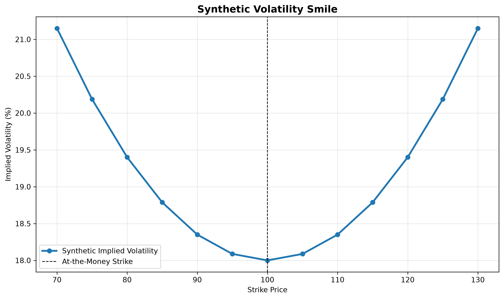
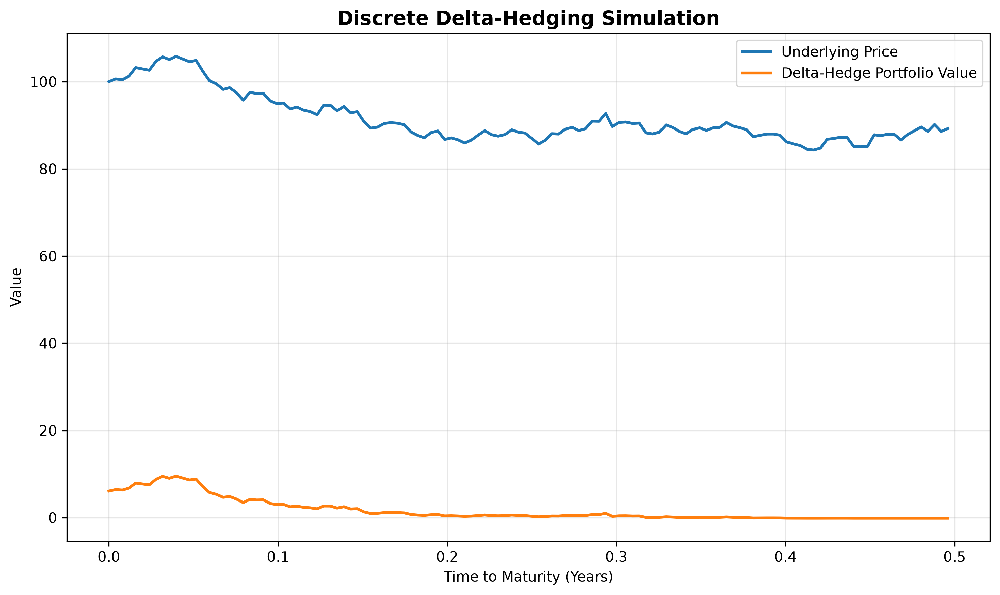

# Options Valuation and Risk Analysis with Black-Scholes-Merton

## Overview

This project implements the Black-Scholes-Merton model for the valuation and risk analysis of European call and put options.

The analysis covers theoretical option pricing, put-call parity validation, option Greeks, implied-volatility estimation, a synthetic volatility smile, and a discrete delta-hedging simulation with transaction costs.

## Key Features

- Black-Scholes-Merton valuation for European call and put options
- Put-call parity validation
- Calculation of Delta, Gamma, Vega, Theta and Rho
- Implied-volatility estimation using the bisection method
- Synthetic volatility-smile analysis
- Discrete delta-hedging simulation with proportional transaction costs
- Sensitivity analysis of option values relative to the underlying price

## Methodology

The model uses the following inputs:

- Spot price of the underlying asset
- Strike price
- Time to maturity
- Continuously compounded risk-free rate
- Annualized volatility
- Continuous dividend yield

The project assumes European exercise, lognormally distributed underlying prices, constant volatility and interest rates, frictionless markets in the theoretical model, and discrete rebalancing with transaction costs in the hedging simulation.

## Results

### Option Price Sensitivity



### Synthetic Volatility Smile

The volatility smile below is generated from synthetic option prices to demonstrate the implied-volatility calculation and visualization workflow. It is not based on live market data.



### Discrete Delta-Hedging Simulation



## Project Structure

```text
option-pricing-volatility-analysis/
├── notebooks/
│   └── 01_black_scholes_model.ipynb
├── outputs/
│   ├── option_price_sensitivity.png
│   ├── synthetic_volatility_smile.png
│   └── delta_hedging_simulation.png
└── README.md
```

## Tools

Python | NumPy | pandas | SciPy | matplotlib | JupyterLab

## Limitations

This project is intended for educational and analytical purposes. Black-Scholes-Merton relies on simplifying assumptions, including constant volatility, continuous trading and the absence of transaction costs. The delta-hedging simulation relaxes the last two assumptions by applying discrete rebalancing and proportional transaction costs.

## Author

**Justus Philippsen**  
B.Sc. Banking & Finance, TH Köln  
[LinkedIn](https://www.linkedin.com/in/justus-philippsen-5b33b036a)
